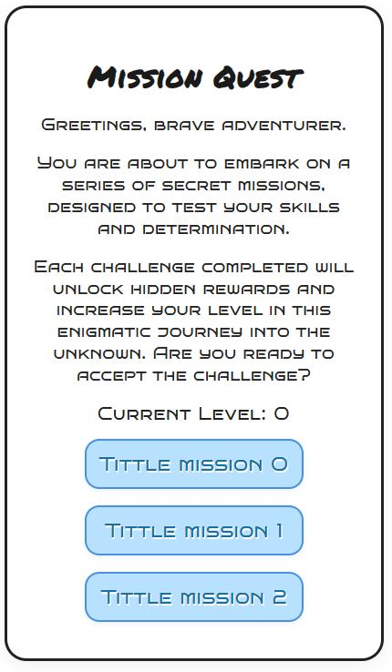
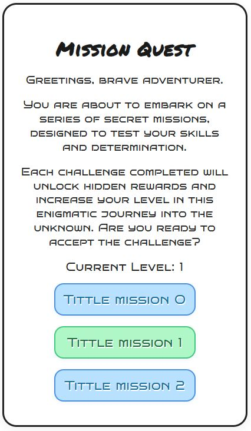

# Mission Quest

🎉 **Mission Quest**: A web application for managing and visualizing missions, perfect for gamers and event organizers!

🎮 **Demo website**: [Demo Mission Quest](https://daviidam.github.io/Mission_Quest)

🇪🇸 **Documentación en Español**: [Readme en Español](README-esp.md)

## ✨ Key Features

🎯 **Join the adventure**: Manage and track your missions with ease. Whether you're planning a party or an event, Mission Quest has you covered.

💻 **Customizable**: Configure your own missions to suit your preferences and the preferences of your group.

💾 **Local progress tracking**: Your progress is automatically saved in your browser's cache, allowing multiple players to maintain independent progress if they are using different browsers.

🧠 **AI-generated applications**: This web application was built as a proof of concept, testing the capabilities of AI-generated applications. It was generated in less than 30 min.

## 📁 Screenshots

<div style="display: flex; flex-direction: row; justify-content: space-between;">
  <div style="display: flex; flex-direction: column; justify-content: space-between;">
    
    
  </div>
  <div style="display: flex; flex-direction: column; justify-content: space-between;">
    
    
  </div>
</div>

## 📁 Project structure

```bash
Mission_Quest/
├── .github/
│   └── workflows/
│       └── deploy.yml # Deploy GitHub Action
├── app/
│   ├── index.html
│   ├── app.js
│   ├── styles.css
│   └── missions/
│       ├── index.json
│       ├── update_index.py
│       └── list/ # List of custom missions
│           ├── 0_custom_mission.json
│           ├── 1_custom_mission.json
│           └── ...
├── README.md
└── DEPLOY.md
```

## ⚙ Customize website

If you have interest to use this project, you can customize it to suit your needs.

1. Create a fork repo from this project.
2. Modify the `app/index.html` file (lines 24-31) to suit your needs. You can configure a different website tittle, text to show, etc.
   ```html
      <div class="container">
      <h1 class="title">Your custom tittle</h1>
      <p class="intro">Your custom text</p>
      <p class="intro">Your custom text</p>
      <p class="intro">Your custom text</p>
      <p class="level">Current Level: <span id="level">0</span></p>
      <div id="missions"></div>
   </div>
   ```

3. Add and modify your custom missions to the `app/missions/list` folder.
   - Create as much json files as you want. But be sure all of them follow the same structure:
      ```json
      {
         "title": "Desired tittle",
         "desc": "Desired description",
         "completed": false
      }
      ```
   - You can use whatever file name for each json file, but have in mind then the list of missions will be ordered by the file name.
4. Run the `app/missions/update_index.py` script. This will recollect all the json files in the `app/missions/list` folder and create an `index.json` file with the list of missions.
   ```bash
   make update_index
   ```
   or
   ```bash
   python3 app/missions/update_index.py
   ```
5. Run the web application locally.
   - This step is only needed if you want to test the changes you made.
   - You can run the web application locally using the following command:
      ```bash
      make run
      ```
      or
      ```bash
      python3 -m http.server 8000 --directory ./app
      ```
   - Open your browser and go to [http://localhost:8000](http://localhost:8000)
6. To be able to deploy the web application, you need to push your changes to the main branch of your forked repo.


## 🚀 Deploy application

The deployment of the web application is automated using GitHub Actions from **main** branch.

When you push your changes to the **main** branch of your forked repo, the GitHub Action will be triggered and the web application will be deployed to GitHub Pages.

### Enable GitHub Pages

GitHub Pages is a free service provided by GitHub. It is a static website hosting service that allows you to host your website for free.

It needs to be enabled for your forked repo.

To enable GitHub Pages, follow these steps:

1. Go to your forked repo on GitHub.
2. Click on the **Settings** tab.
3. Scroll down to the **Pages** section.
4. Under **Source**, select **Deploy from branch**, choose **main** branch and **/(root)** folder.
5. Click on the **Save** button.

### See your deployed website

Once the deployment is complete, you can see your deployed website at the URL provided by GitHub Pages.

Usually it looks like the example below:

```
https://<your-username>.github.io/Mission_Quest
```

But if it doesn't work, go to **Actions** tab and check the logs of the last deployment.


## 💡 Notes
- Make sure you have Python installed to run the update script and the web locally.
   - There's a **.devcontainer** folder in the repo that allows you to run the web application locally using Visual Studio Code.
- If you have any questions or need help, don't hesitate to ask!
